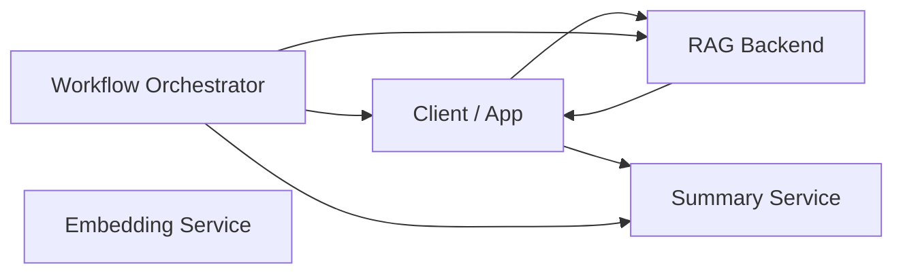

# 🧠 AI Backend Portfolio — Jeff Ellis

### A production-grade, Go-based AI backend ecosystem focused on **Retrieval-Augmented Generation (RAG)** with a supporting orchestration layer.

This organization contains a cohesive set of **AI backend microservices** designed to mirror real-world backend and AI engineering systems.
The core focus is **RAG architecture**, supported by embeddings, summarization, and an optional orchestration layer.

All services are containerized, deployed, documented, and built with production patterns in mind.

---

# 🌐 System Architecture Overview



---

# 📦 Repositories

### **1. Notes Memory Core — RAG Extension (Flagship)**

A production-ready **Retrieval-Augmented Generation backend** built with Go, Postgres, and pgvector.
Implements semantic search, embeddings, top-K retrieval, and context preparation for downstream AI tasks.

📌 [https://github.com/ai-backend-course/notes-memory-core-rag](https://github.com/ai-backend-course/notes-memory-core-rag)

---

### **2. Notes Memory Core**

The foundational CRUD backend for storing and retrieving notes.
Demonstrates clean service layout, Postgres integration, logging, and metrics.

📌 [https://github.com/ai-backend-course/notes-memory-core](https://github.com/ai-backend-course/notes-memory-core)

---

### **3. AI Embedding Microservice**

A dedicated embedding service supporting mock and real OpenAI embeddings, with validation, rate limiting, and observability.

📌 [https://github.com/ai-backend-course/ai-embedding-microservice](https://github.com/ai-backend-course/ai-embedding-microservice)

---

### **4. AI Summary Service**

An LLM-powered summarization microservice used to condense retrieved context before response generation.

📌 [https://github.com/ai-backend-course/ai-summary-service](https://github.com/ai-backend-course/ai-summary-service)

---

### **5. Workflow / Orchestration Service (Supporting Project)**

A lightweight orchestration layer that coordinates retrieval and summarization services, applies evaluation, and produces structured responses.

This service is **not the core focus** of the portfolio, but demonstrates how multiple AI backend services can be coordinated in a controlled workflow.

📌 [https://github.com/ai-backend-course/agentic-workflow-service](https://github.com/ai-backend-course/agentic-workflow-service)
🌐 [https://agentic-workflow-service.fly.dev](https://agentic-workflow-service.fly.dev)

---

# 🚀 Skills Demonstrated

* Go (Golang) backend development
* Fiber v2: routing, middleware, handlers
* Retrieval-Augmented Generation (RAG) architecture
* Embeddings and vector search (pgvector)
* Service-to-service AI backend design
* Postgres 16 + pgxpool
* Semantic search and top-K retrieval
* AI summarization pipelines
* Docker + multi-stage builds
* Fly.io production deployment
* TLS and container runtime configuration
* Logging, tracing, and observability
* Clean, production-oriented API design

---

# 🏆 About This Portfolio

This portfolio is centered on **RAG-first AI backend systems**, reflecting how many real-world AI applications are built today.

The projects emphasize:

* Clear API boundaries
* Production-ready backend patterns
* Deployable services
* Explainable AI pipelines
* Incremental system design

The orchestration layer is included to show **service coordination and workflow control**, while the primary strength remains **retrieval, data grounding, and backend reliability**.

This work aligns with **AI Backend Engineer**, **Backend Engineer (AI-enabled systems)**, and **RAG-focused roles**.

---

# 📬 Contact

```
Jeff Ellis  
AI Backend Developer  
Email: jellis777@gmail.com  
GitHub: https://github.com/jellis777
```
