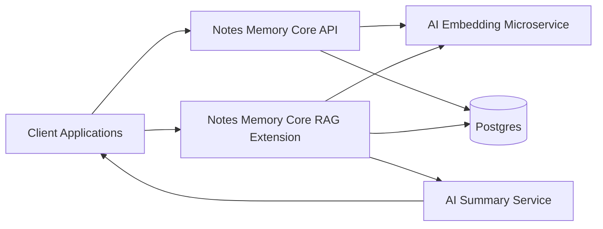

# 🧠 AI Backend Portfolio — Jeff Ellis  
### A cohesive, production-grade ecosystem of Go microservices that together power a full Retrieval-Augmented Generation (RAG) AI backend.

This organization contains **four coordinated microservices**, each deployed, containerized, documented, and ready for professional backend and AI engineering workflows.

---

## 🌐 System Architecture Overview




---

# 📦 Repositories

### **1. AI Embedding Microservice**  
Deterministic & real OpenAI embeddings with rate limiting, validation, metrics, and secure middleware.  
📌 https://github.com/ai-backend-course/ai-embedding-microservice

---

### **2. Notes Memory Core — RAG Extension**  
Vector search (pgvector), embeddings, semantic search, top-K retrieval, LLM query pipeline.  
📌 https://github.com/ai-backend-course/notes-memory-core-rag

---

### **3. Notes Memory Core**  
Base CRUD service with Postgres, Fiber, logging, metrics, and clean service layout.  
📌 https://github.com/ai-backend-course/notes-memory-core

---

### **4. AI Summary Service**  
LLM-powered summarization microservice with mock/real model layers.  
📌 https://github.com/ai-backend-course/ai-summary-service

---

# 🚀 Skills Demonstrated

- Go (Golang) backend development  
- Fiber v2: routing, middleware, handlers  
- Postgres 16 + pgxpool  
- pgvector vector search & cosine similarity  
- AI microservice architecture  
- OpenAI embeddings + GPT-4o-mini  
- Docker + multi-stage builds  
- Fly.io deployment  
- Logging (Zerolog)  
- In-memory metrics & observability  
- Production API structure  
- RAG architecture end-to-end  

---

# 🏆 About This Portfolio

This organization showcases a real, deployable ecosystem powering a complete AI backend stack, designed with:

- Clean architecture  
- Clear API boundaries  
- Real deployments  
- Consistent documentation  
- Reproducible environments  
- Industry-ready patterns  

Each project is built to mirror the expectations of junior–mid Go backend and AI backend engineering roles.

---

# 📬 Contact:

```
Jeff Ellis  
AI Backend Developer  
Email: jellis777@gmail.com
GitHub: https://github.com/jellis777
```
